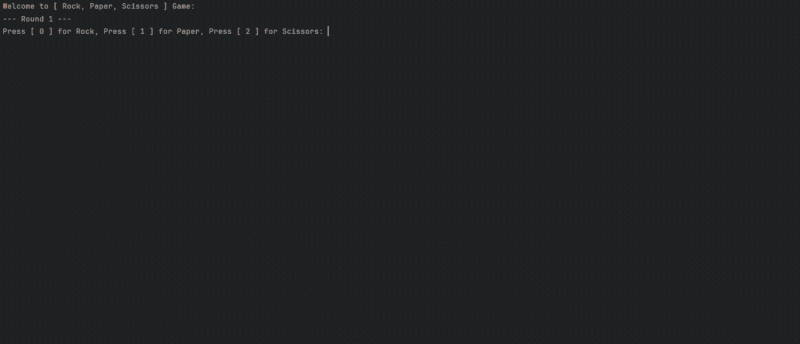
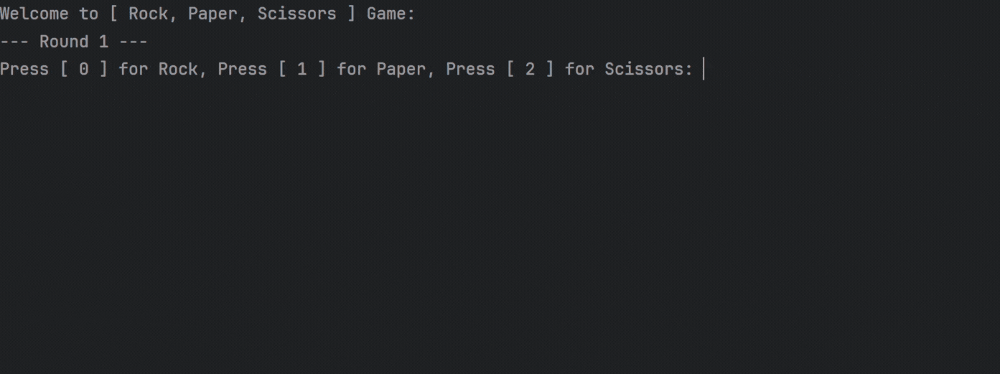

# 🪨📄✂️ Rock Paper Scissors Game (Java)
A simple and fun **console-based Rock, Paper, Scissors game** built in **Java**. Play against the computer for 5 rounds, with real-time input validation and score tracking.

---

## 🧩 Features

- 🎮 Play classic Rock, Paper, Scissors for 5 rounds
- 🤖 Computer randomly selects its move each round
- 🧠 Real-time win/lose logic with score tracking
- ❌ Handles invalid input gracefully
- 📟 Clean console-based UI with helpful prompts

---

## 🎥 Demo

### 🟢 Game Start Demo


---

### 🟡 Quick Rounds Demo  


---

### 🔵 Full Game Walkthrough  


---

### ❌ Invalid Input Demo  



---

## 🛠️ How to Run

1. Make sure you have **Java installed**  
2. Clone or download this repository  
3. Compile and run the file:

```bash
javac RockPaperScissors.java
java RockPaperScissors
```

---

### 🎨 Updated Version – Now with Emoji UI & Enhanced Console Experience!

> This version brings a more fun and engaging user interface using emojis, better prompts, and an overall polished look. Check out the upgraded gameplay in action below! 🎮✨

https://github.com/user-attachments/assets/a2f7f7c0-6fb3-4b0c-825e-ea7e0e235125


📚 More Projects <br>
Check out more of my projects on my [GitHub profile](https://github.com/Saswat-King)
